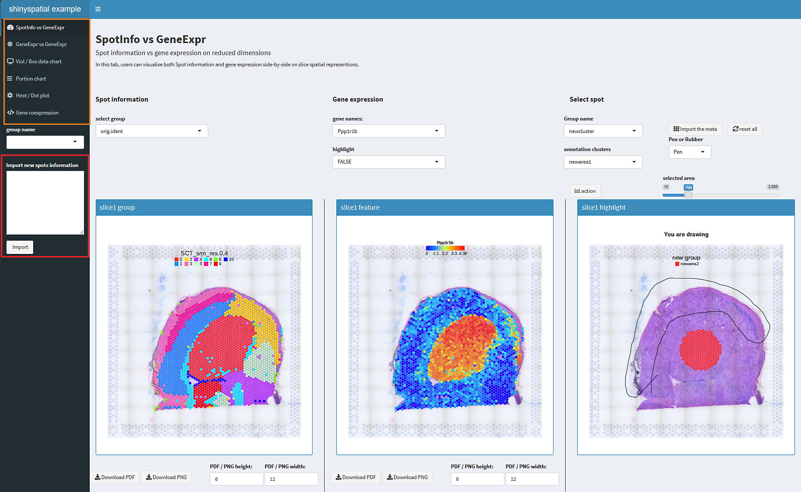
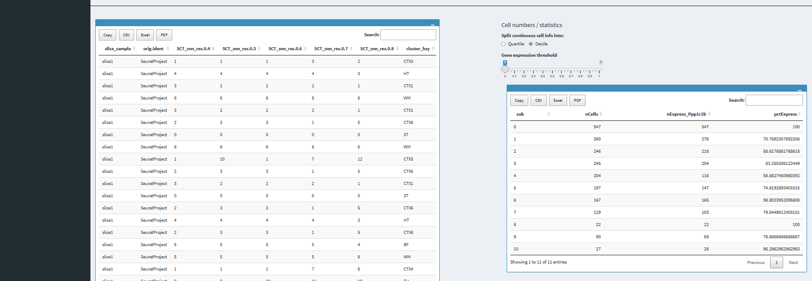
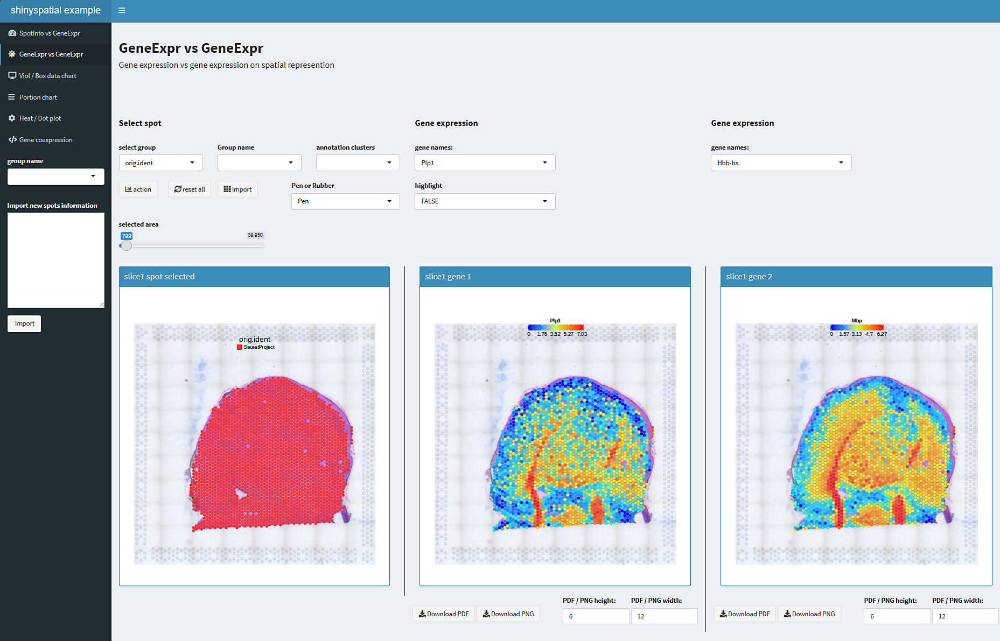
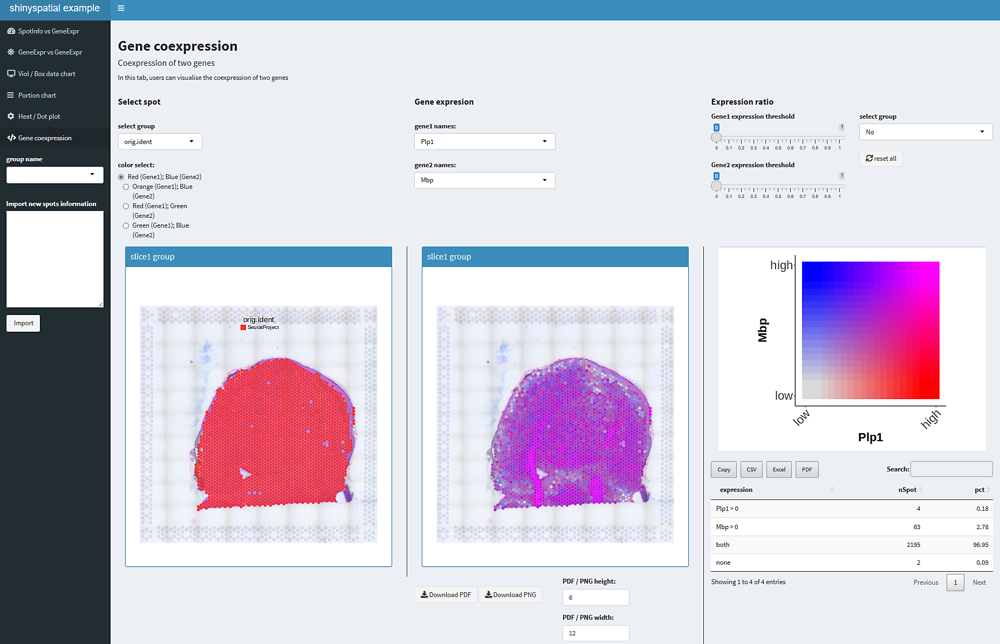
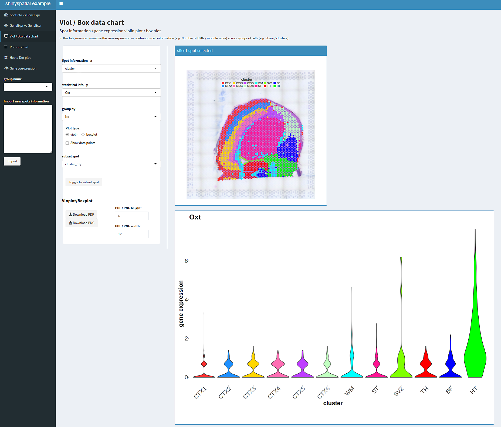
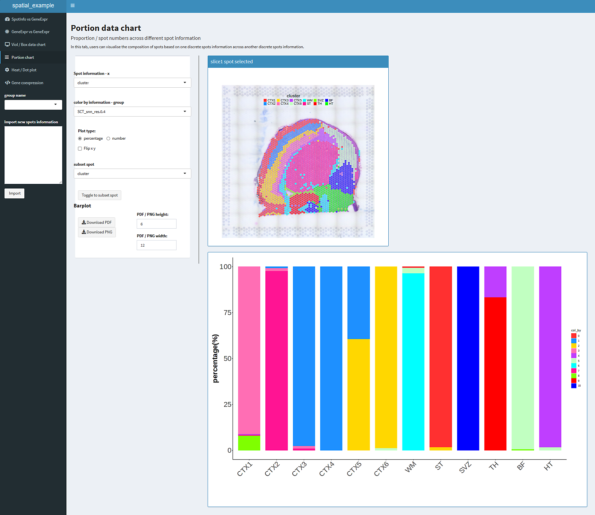
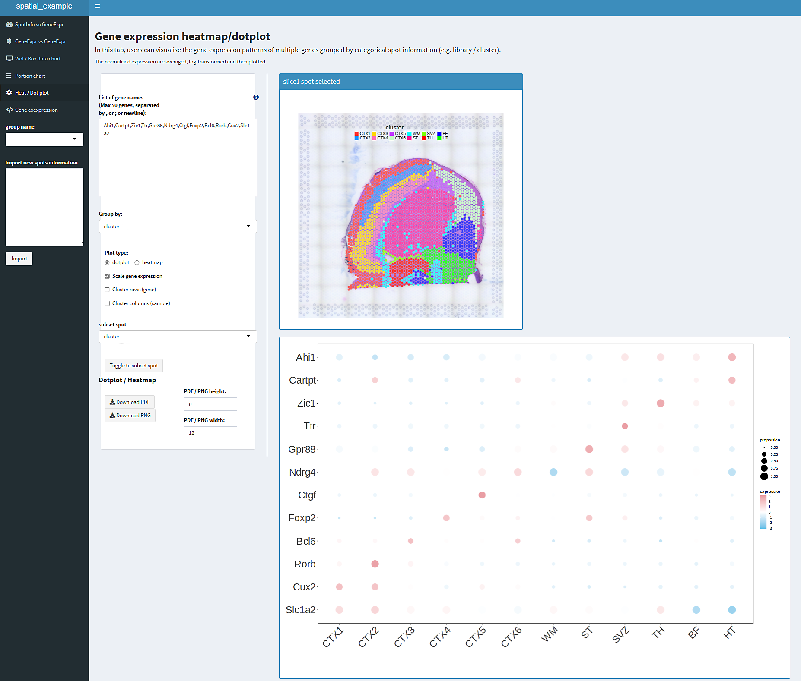

# ShinySRT

---

### Description
`ShinySRT` an interactive and sharable Shiny-based web application for spatially resolved transcriptomics. It is designed to process various prevalent formats of spatial transcriptome data, enabling the creation of an interactive interface tailored for comprehensive data analysis.The interactive interface created by ShinySpatial is entirely open-source and is amenable to extensive customization to align with the specific requirements of the user.

---

### Features
- Written in R, using a shiny application that generates an interactive interface that can be mounted to a server or shared on the web.
- It supports several major spatial transcriptome data formats, in addition to specific list imports.
- Multiple spatial transcriptome slice samples data can be imported into shiny web app.
- Customizing spatial spot annotations and and spot selection
- Multivariate comparisons. Analyzing the change in the dependent variable with the independent variable in different groups
- Visualization images and data sheet downloads
- One-step generation of the shiny interface, shiny app is completely open source and can be customized

[SCE obj](docs/SingleCellExperimentprocess.md)
| Data      | Object Type | source |
| ----------- | ----------- | ----------- |
| 10x Visim (Seurat)     | Seurat       | [seurat obj](# Content and Guide) |
| SingleCellExperiment   | SCE        | [SCE obj](docs/SingleCellExperimentprocess.md) |
| SpatialExperiment   | SPE        | [SPE obj](docs/SpatialExperimentprocess.md) |
| Vizgene (Seurat)  | Seurat        | [viz_seurat obj](docs/vizgeneprocess.md) |
| 10x Visim (scanpy)   | h5ad        | [h5ad class](docs/scanpyprocess.md) |
| Customizable list   | list        | [lists](docs/customlistprocess.md) |

Users can build own list containing matrix, meta, data, coordinate information, image.

---

### Installation
To get started, you need to check that the required installation packages for `ShinySRT` are already installed:

``` r
packages <- c(
               'SingleCellExperiment','SpatialExperiment','data.table','dplyr',
               'glue','hdf5r','readr','reticulate','ggplot2','graphics','gridExtra',
               'patchwork','RColorBrewer','maps','Cairo','grid','ggtree','aplot',
               'magrittr','ggrepel','ggdendro','Matrix','scales','aplot'
             )
packages = packages[!(packages %in% installed.packages()[,"Package"])]
if(length(packages)){install.packages(newPkg)}             
```
Then check that all required shiny-related packages are installed:

``` r
packages <- c('shiny','shinyhelper','DT','shinydashboard')
packages = packages[!(packages %in% installed.packages()[,"Package"])]
if(length(packages)){install.packages(newPkg)}
```


---

### Content and Guide
The basic workflow is that `ShinySRT` generates the required configuration files and shiny app code by utilizing spatial transcriptome data objects.The specific operation code is as follows:

``` r
# 10x Visim
library(ShinySpatial)
library(Seurat)
library(SeuratData)

InstallData("stxBrain")
brain <- LoadData("stxBrain"， type = "anterior1")

makespashiny(brain,title = 'ShinySRT exmaple')

# SpatialExperiment
library(SpatialExperiment)
example(read10xVisium, echo = FALSE)

makespashiny(spe,title = 'ShinySRT exmaple')
```

The spatial transcriptome data was processed by scanpy to obtain the h5ad file, and the following code uses public data from the 10x platform [Mouse Brain Serial Section 2 (Sagittal-Anterior)](https://www.10xgenomics.com/resources/datasets/mouse-brain-serial-section-2-sagittal-anterior-1-standard)

``` r
# h5ad
makespashiny(spe,title = 'ShinySRT exmaple')
```

Run one line of code, a new directory called `/shinyspatial_app` will be created in the current directory, where the shiny app exists, and where the user can call `shiny::runApp` to run the app locally in Rstudio.In addition, it is possible to use the server's app remotely by mounting the shiny app's directory in the `/srv/shiny-server` directory of the server that has the proxy. In addition, the app can be used remotely by mounting the shiny app directory in the `/srv/shiny-server` directory of a server with a proxy. shiny apps can also be deployed to other web platforms in other ways [shinyapps.io](https://www.shinyapps.io/)

We use a 10x spatial transcriptome data within the lab as an example to demonstrate content of `ShinySRT`.

The shiny app generated by `ShinySRT` consists of six main modules, with the module names shown in the leftmost menu bar in the figure. At the bottom of the menu bar(highlighted in orange box), there is an input field for importing annotations for new spots(highlighted in red box).

The current display is the first module "SpotInfo vs GeneExpr", which mainly shows the relationship between the annotation information of spatial spots and gene expression. Switch the annotation information of the spots by the drop-down menu at "Spot information" and select the displayed genes by the drop-down menu at "Gene expression". On the right hand side is the area for customized spot selection which can be used to select the area by drawing circle or clicking, and it need to name the annotation area before selecting.





For storing new annotation information, you need to first create a column name for this group of annotation information, and then stored in the form of columns in the following figure in the metadata list, the list can be downloaded and exported, and then use this annotation can be copied from the column and pasted in the left input area. metadata on the right side of the gene in the display of the expression of the spots information statistics.





The second module "GeneExpr vs GeneExpr" focuses on the relationship between the spatial expression of two genes, in the same way as the selection of spots in the first module.





In addition to this, Module 4 demonstrates the relationship between two genes by the spatial co-determination of two genes in the same slice sample. Thresholds for gene expression can be set using the sliders on the right, and the table below shows the statistics for the co-determination of the genes.





The third module, "Viol / Box data chart", plots traditional statistical box and violin plots based on the annotation information and gene expression or scoring of the spot, showing the relationship between the annotation information and genes.





The fourth module, "Portion data chart", shows the proportion of one grouping of information over another, e.g., the proportion or number of seurat subgroups in each anatomical region of the brain, with most of the spots in the HT region belonging to the four subgroups.





The sixth module shows the expression of genes in different regions by means of "bubble charts or heatmaps", which can also be clustered in rows and columns respectively.





---
