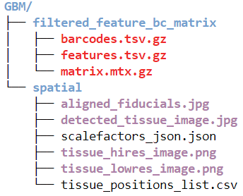
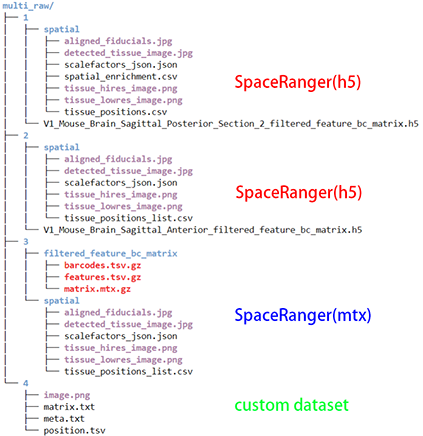
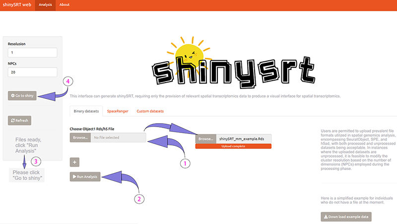

# shinySRT

---


## Description


`shinySRT` is a web application developed utilizing the Shiny framework, explicitly designed for the sharable and interactive visualization of spatially resolved transcriptomics data. This application is adept at processing various formats of spatial transcriptome data, facilitating the development of an interactive interface conducive to thorough data analysis. The interactive interface of shinySRT is open-source, offering significant customization potential to align with the unique requirements of users.


---

## Features

- Developed under R, utilizing a Shiny application that generates an interactive and shareable interface via the web.
- Provides compatibility with various prominent formats of spatial transcriptome data.
- Facilitates the import of multiple ST datasets into the Shiny web application.
- Allows for the customization of spatial spot selection.
- Supports multivariate comparisons, enabling the analysis of how the dependent variable changes across different groups of independent variables.
- Offers features for visualizing images and downloading data sheets.
- Simplifies the creation of the Shiny interface in a single step, and the Shiny app is entirely open source and customizable.


| Data      | Object Type | source |
| ----------- | ----------- | ----------- |
| 10x Visim     | Seurat       | [seurat obj](https://www.10xgenomics.com/resources/datasets?menu%5Bproducts.name%5D=Spatial%20Gene%20Expression&query=&page=1&configure%5BhitsPerPage%5D=50&configure%5BmaxValuesPerFacet%5D=1000) |
| SingleCellExperiment   | SCE        | [SCE obj](docs/SingleCellExperimentprocess.md) |
| SpatialExperiment   | SPE        | [SPE obj](docs/SpatialExperimentprocess.md) |
| Vizgene  | Seurat        | [viz_seurat obj](docs/vizgeneprocess.md) |
| 10x Visim   | h5ad        | [h5ad class](docs/scanpyprocess.md) |
| Customizable list   | list        | [lists](docs/customlistprocess.md) |


Users could deploy their application utilizing a customized list that includes an expression matrix, metadata, imagery, as well as coordinate information.

---

## Installation

To begin, it's important to verify whether the necessary installation packages for `shinySRT` have already been installed (The best version of R is 4.2 or above, to prevent some R packages are not good to install or incompatibility):

``` r

# If you employ Conda, it is imperative to install the essential packages requisite for the analysis of single-cell and spatial genomic data.
# mamba install conda-forge::r-cairo conda-forge::r-hdf5r conda-forge::r-curl conda-forge::r-devtools conda-forge::r-stringi conda-forge::r-biocmanager conda-forge::r-rfast conda-forge::quadprog -y

if (!require('pacman')) install.packages('pacman')

BiocManager::install(c('scran','Seurat'))


devtools::install_github(c('YuLab-SMU/ggtree', 'silhouette99/shinySRT'))
# remotes::install_github(c('YuLab-SMU/ggtree', 'silhouette99/shinySRT'))
# install.package('Seurat')

pacman::p_load(
  'Cairo',
  'hdf5r',
  'data.table',
  'magrittr',
  'dplyr',
  'glue',
  'readr',
  'reticulate',
  'ggplot2',
  'graphics',
  'gridExtra',
  'patchwork',
  'RColorBrewer',
  'maps',
  'grid',
  'ggtree',
  'ggrepel',
  'ggdendro',
  'Matrix',
  'scales',
  'aplot',
  'keys',
  'ggiraph',
  'ggpubr',
  'shiny',
  'shinyhelper',
  'DT',
  'shinydashboard',
  'scran',
  'scatterpie',
  'quadprog',
  'Rfast',
  'SingleCellExperiment',
  'SpatialExperiment'
)

```


---

## Quick Start

The primary procedure entails `shinySRT` producing the necessary configuration files and web application file by employing SRT data objects. The specific operational code is delineated as follows:

### For a Seurat object

``` r
# 10x Visim
suppressMessages(library(shinySRT))
library(Seurat)
library(SeuratData)

InstallData("stxBrain")
brain <- LoadData("stxBrain", type = "anterior1")

CreateshinySRT(brain,title = 'shinySRT exmaple', sp_normalize = F, gene.mapping = F)

# SpatialExperiment
library(SpatialExperiment)
example(read10xVisium, echo = FALSE)

CreateshinySRT(spe,title = 'shinySRT exmaple',maxlevel = 20)

# run shiny app
shiny::runApp('shinyspatial_app/')
```

### For a h5ad object generating by SCANPY

The SRT was processed using scanpy to obtain the h5ad file, while the following URL was used to access the source data from [10X](https://www.10xgenomics.com/resources/datasets/mouse-brain-serial-section-2-sagittal-anterior-1-standard).


``` r
# h5ad
CreateshinySRT(dat = 'Anterior.h5ad',title = 'spatial experiment', sp_normalize = F)

# run shiny app
shiny::runApp('shinyspatial_app/')

```

Upon running a single line of code, a new directory named `/shinyspatial_app` will be generated in the current directory, where the Shiny app is located. Users can utilize `shiny::runApp` to locally run the app within R env. Furthermore, the app can be deployed remotely by placing the shiny app's directory into the `/srv/shiny-server` directory of a server that has a proxy. It's worth noting that Shiny apps can also be deployed on various web platforms using alternative methods. For more comprehensive information, please refer to [shinyapps.io](https://www.shinyapps.io/).


## APP guidance

We use a 10x SRT data within the lab as an example to demonstrate content of `shinySRT`.

The Shiny app created by `shinySRT` comprises five primary modules, as indicated by the module names in the leftmost menu bar in the figure. At the bottom of the menu bar (highlighted in an orange box), there is an input field for importing annotations for new spots (highlighted in a red box).


The current view represents the initial module titled "SpotInfo vs GeneExpr," primarily illustrating the connection between spatial spot annotations and gene expression. Users can switch the spot annotations using the dropdown menu labeled "Spot information" and choose the displayed genes from the dropdown menu labeled "Gene expression." The top of the gene in the display of the expression of the spots information statistics(highlighted in a green box), You can select regions for comparison by using the following spatial plot, these operations will also be reflected in the table, the following interactive selection of spots using ggiraph's method, by hovering over the spatial plot to get the information of each spatial plot, please refer to the specific use of [ggiraph](https://davidgohel.github.io/ggiraph/).


The second module, 'GeneExpr vs GeneExpr', is dedicated to examining the relationship between the spatial expressions of two genes. Expression thresholds for these genes can be adjusted using the sliders on the right, while the adjacent table provides statistical analysis pertaining to the co-determination of the genes.


The third module, titled 'Viol / Box Data Chart', is designed to generate convetional statistical box and violin plots. These plots are derived from the annotation information, alongside the gene expression or scoring of the spot, thereby illustrating the relationship between the annotation information and the genes.


The fourth module, "Portion data chart", shows the proportion of one grouping of information over another, e.g., the proportion or number of seurat subgroups in each anatomical region of the brain, with most of the spots in the HT region belonging to the four subgroups.


The fifth module shows the expression of genes in different regions by means of "bubble charts or heatmaps", which can also be clustered in rows and columns respectively.


ShinySRT also incorporates deconvolution functionality, allowing the inference of cellular components within samples by integrating the expression matrix and metadata from single-cell transcriptomics. These results can be visualized within the interface. The deconvolution process is based on the DWLS (Doubly Weighted Least Squares) method utilized in [Giotto](https://giottosuite.readthedocs.io/en/latest/subsections/datasets/mouse_visium_brain.html). Please refer to [deconvolusion](docs/deconvolusion.md) for specific instructions.


<div align=center>

</div>


ShinySRT can also read and process raw data output by SpaceRanger and custom datasets (such as matrices, positions, etc.) to obtain a complete Seurat object. Afterward, running CreateShinySRT will generate the corresponding interface.


<div align=center>

</div>


```r
library(shinySRT)

dir.create('shinyexample')
setwd('shinyexample')

## matrix: SRT data directory
## single SRT data
## rawdata process
dat <- single_op_dir(dir = 'GBM/')

CreateshinySRT(dat)

```


For the convenience of reading and processing multiple samples, users need to place the directories of multiple samples in a common directory.


<div align=center>

</div>

```r
library(shinySRT)

## rawdata process
dat <- shinySRT::multi_dir_spatial('multi_raw/')

dir.create('multi_sample')
setwd('multi_sample')

CreateshinySRT(dat)

```

We have also established a webpage for shinySRT where users can upload their own SRT data to generate the corresponding interface, as shown in the following figure. For detailed instructions, please refer to the [webpage](https://shinysrt.kratoss.site/apps/archive/shinySRT_display/shinyspatial_app/).


<div align=center>

</div>

---


## Q&A

Visit [issues](https://github.com/silhouette99/ShinySRT/issues) or contact [Pan](https://github.com/silhouette99)


If you use the tool in your publication, please cite by


